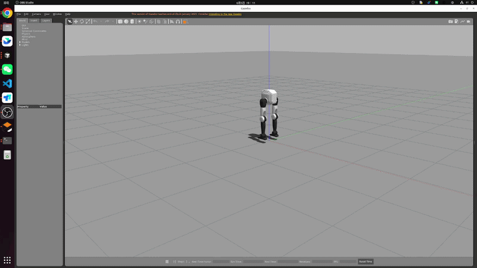
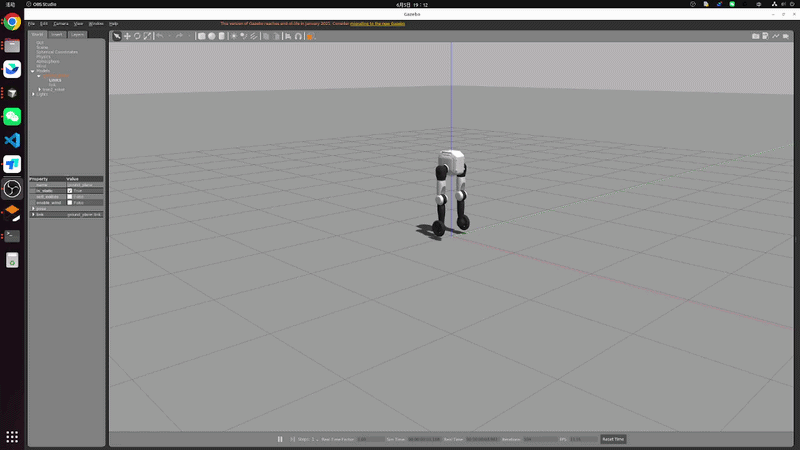

# TRON2 ROS 工作区说明（`~/limx_ws/src`）

本目录是 TRON2 在 ROS Noetic 下的源码空间（catkin `src`），包含仿真侧与控制侧两类包。

## 1. 目录结构

当前建议结构如下：

```text
~/limx_ws/src
├── CMakeLists.txt                 # catkin 顶层入口（通常为软链接）
├── robot-description              # 机器人模型描述包（独立放在 src 一级）
├── limxsdk-lowlevel               # 低层 SDK 包（独立放在 src 一级）
├── tron2-gazebo-ros               # 仿真相关包集合
│   ├── limxsdk-sim
│   └── tron2_gazebo
└── tron2-rl-deploy-ros            # 控制/部署相关包集合
    ├── onnxruntime_sdk
    ├── robot_common
    ├── tron2_controllers
    └── tron2_hw
```

> 注意：catkin 支持递归发现包，因此子目录分组不会影响编译，只要每个 ROS 包内有合法 `package.xml` 与 `CMakeLists.txt`。

## 2. 环境要求

- Ubuntu 20.04
- ROS Noetic（建议 `ros-noetic-desktop-full`）
- Gazebo 11（ROS Noetic 默认）
- 常见依赖（按需补齐）：

```bash
sudo apt-get update
sudo apt-get install -y \
  ros-noetic-gazebo-ros-pkgs \
  ros-noetic-gazebo-ros-control \
  ros-noetic-ros-control \
  ros-noetic-ros-controllers \
  ros-noetic-controller-manager \
  ros-noetic-joint-state-controller \
  ros-noetic-rqt-controller-manager \
  ros-noetic-robot-state-publisher \
  libeigen3-dev
```

## 3. 创建工作空间

可以按照以下步骤，创建一个算法开发工作空间：

- 打开一个 Bash 终端。

- 创建一个新目录来存放工作空间。例如，可以在用户的主目录下创建一个名为“limx_ws”的目录：

  ```
  mkdir -p ~/limx_ws/src
  ```

- 下载运动控制开发接口：

  ```
  cd ~/limx_ws/src
  git clone https://github.com/limxdynamics/limxsdk-lowlevel.git
  ```

- 下载 Gazebo 仿真器：

  ```
  cd ~/limx_ws/src
  git clone https://github.com/limxdynamics/tron1-gazebo-ros.git
  ```

- 下载机器人模型描述文件

  ```
  cd ~/limx_ws/src
  git clone https://github.com/limxdynamics/robot-description.git
  ```
在工作区根目录执行：

```bash
cd ~/limx_ws
source /opt/ros/noetic/setup.bash
catkin_make
```

编译成功后建议加载环境：

```bash
source ~/limx_ws/devel/setup.bash
```

## 4. 运行示例

### 4.1 启动仿真（完整部署）

```bash
cd ~/limx_ws
source /opt/ros/noetic/setup.bash
source devel/setup.bash
# 启动包含 Gazebo 场景、硬件节点和控制器的完整仿真
roslaunch tron2_hw tron2_hw_sim.launch robot_type:=SF_TRON2A
```

`robot_type` 可按你的配置切换（例如 `SF_TRON2A` / `WF_TRON2A`）。


### 4.2 仅启动控制器（仿真模式）

如果你已经手动启动了 Gazebo 场景，可以只启动硬件节点和控制器：

```bash
roslaunch tron2_hw tron2_controller_sim.launch robot_type:=SF_TRON2A
```

### 4.3 实物部署

```bash
roslaunch tron2_hw tron2_hw.launch robot_type:=SF_TRON2A robot_ip:=10.192.1.2
```

## 5. 仿真与实机逻辑说明（重要）

结论：**核心控制链路逻辑一致**，都是：

- `tron2_hw_node`（`Tron2HW`） -> `RobotHWLoop` -> `controller_manager` -> `tron2_controller`

但两者有输入侧差异：

- 仿真（`tron2_hw_sim.launch`）默认还会发 `/cmd_vel` 和 `/tron2_controller/set_mode`。
- 实机（`tron2_hw.launch`）主要走 SDK 订阅的通道。

## 6. 控制参数位置

主要控制参数位于：

- `tron2-rl-deploy-ros/tron2_controllers/config/SF_TRON2A/params.yaml`
- `tron2-rl-deploy-ros/tron2_controllers/config/WF_TRON2A/params.yaml`

## 7. 效果展示

### 7.1 仿真部署




### 7.2 实机部署

实机部署时请悬挂启动控制器


## 8. 常见问题

- 启动时报找不到包：
  - 确认已执行 `source /opt/ros/noetic/setup.bash`
  - 确认已执行 `source ~/limx_ws/devel/setup.bash`
- 修改目录后编译异常：
  - 在 `~/limx_ws` 下重新执行 `catkin_make`
- Gazebo 插件/控制器加载失败：
  - 先确认 `tron2_gazebo`、`tron2_hw`、`tron2_controllers`均已成功编译

## 6. License

[Apache 2.0](../tron2-rl-deploy-ros/LICENSE)
